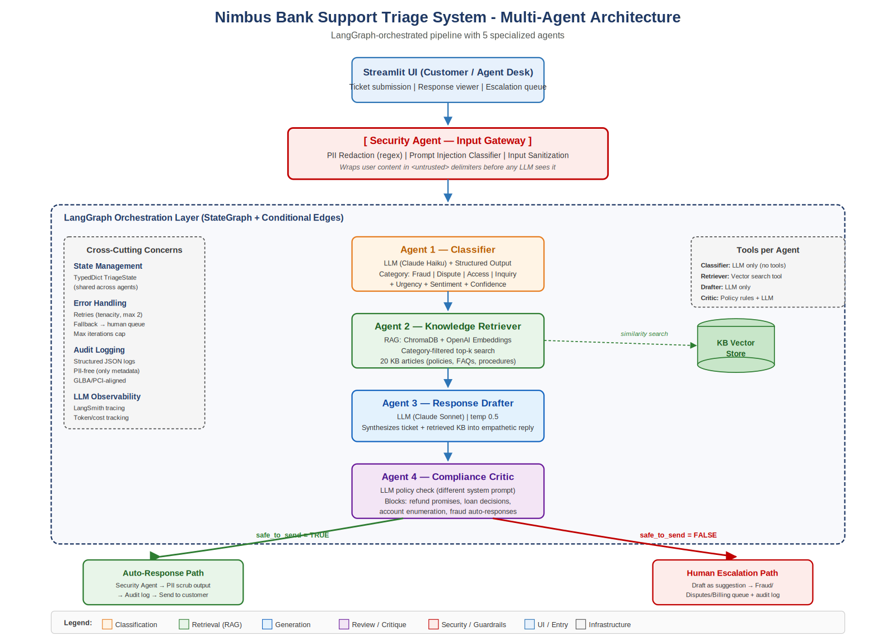

# Nimbus Bank Intelligent Support Triage

This Space hosts a multi-agent customer-support triage system for a banking use case.

## What It Does

- Classifies incoming tickets
- Retrieves relevant knowledge-base articles
- Drafts a customer response
- Applies compliance review and escalation rules
- Redacts PII and writes structured audit metadata

## Required Space Secrets

Add these in the Hugging Face Space **Settings -> Variables and secrets** section before the app runs:

- `ANTHROPIC_API_KEY` - required
- `LANGSMITH_API_KEY` - optional

## Notes

- This Space uses a Docker runtime because Hugging Face recommends Docker for Streamlit deployments.
- The Chroma knowledge-base index is already bundled in the repository.
- On first build, the container pre-downloads the local embedding model used by retrieval.

## Architecture

